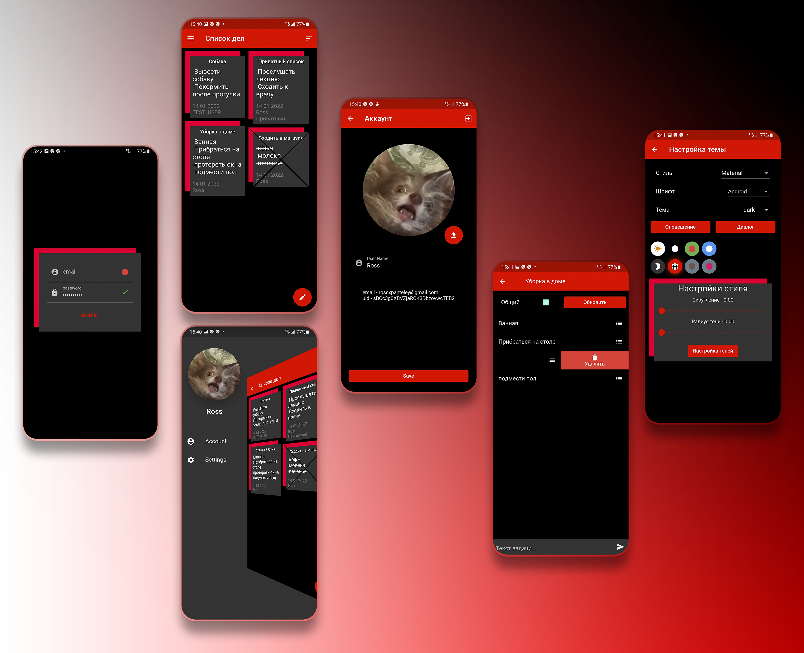
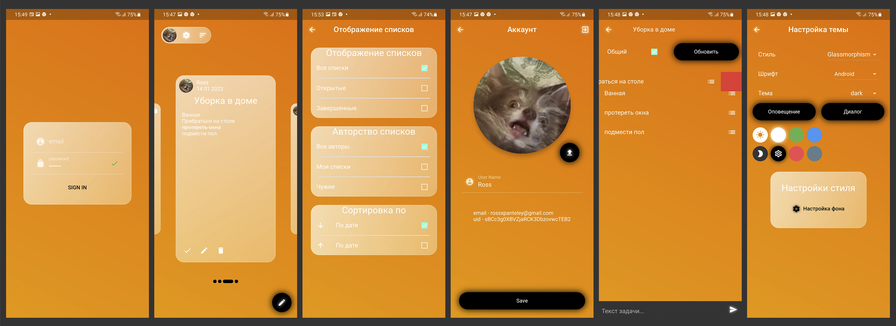

# Todo List App

Flutter приложение для формирования групповых и приватных списков с широкой кастомизацией пользовательского интерфейса

[Основные особенности](#-основные-особенности) •
[Используемый стек](#-используемый-стек) •
[Демо](#%EF%B8%8F-демо)

## 📋 Основные особенности

- Аутентификация пользователей
- Приватные/личные списки для одного пользователя и общие, для всех людей в группе
- Фильтрация и сортировка задач
- Система рассылки уведомлений
- Широкая кастомизация графики на основе 3 тем
  - Material
  - Animated90s
  - Glassmorphism
  
### Material

### Animated90s

### Glassmophism

## 📦 Используемый стек

- Архитектура - MVC/BLoC
- Менеджер состояний/зависимостей - [Get](https://pub.dev/packages/get)
- Shared Preferences - [Get Storage](https://pub.dev/packages/get_storage) 
- Бэкенд - [Firebase](https://firebase.google.com/)
  - БД - [Firestore](https://firebase.google.com/docs/firestore) и [Storage](https://firebase.google.com/docs/storage)
  - Аутентификация пользователей - [Authentication Firebase](https://firebase.google.com/docs/auth)
  - Сервис рассылки оповещений - [Firebase Messaging](https://firebase.google.com/docs/cloud-messaging)
  - Небольшой собственный сервер на java с использованием [Firebase Admin SDK](https://firebase.google.com/docs/admin/setup), который нужен для формирования и отправки оповещений (используя [API FMC](https://firebase.google.com/docs/cloud-messaging)) о новой задаче другим пользователям
- Тестирование [NoSQL Firestore](https://firebase.google.com/docs/firestore) - Mock библиотека [Fake Cloud Firestore](https://pub.dev/packages/fake_cloud_firestore) 

## 🎞️ Демо
